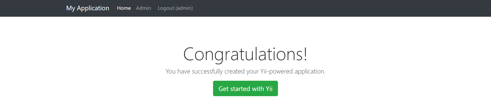
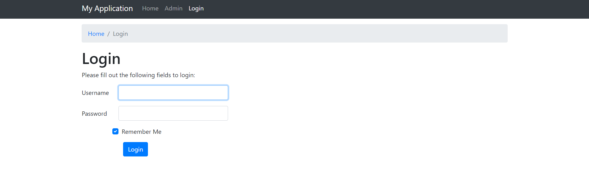
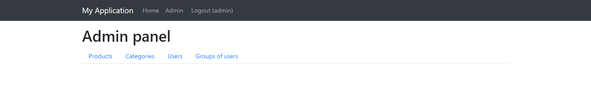
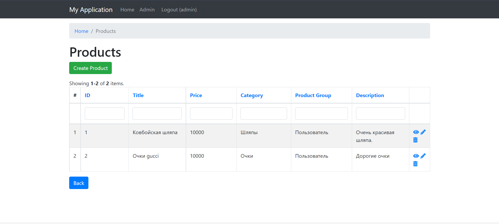
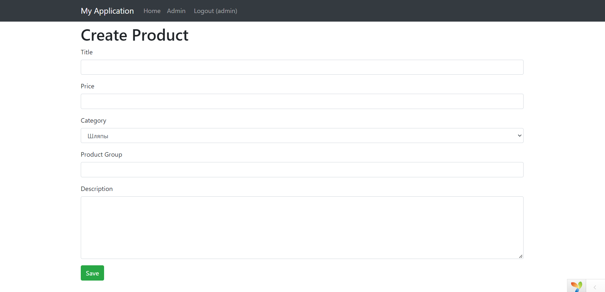

Admin Panel
==================

Использовал [Yii2](https://www.yiiframework.com/), openServer, phpmyadmin.

В папке sql находится база данных с таблицами: товары, категории, пользователи, группы пользователей.

Структра папок
-------------------

      assets/             содержит подключение ресурсов (js, css)
      commands/           содержит консольные команды
      config/             содержит конфигурационные файлы
      controllers/        содержит классы контроллеров
      mail/               содержит файлы представлений для электронной почты
      models/             содержит классы моделей
      runtime/            содержит файлы, созданные во время работы сайта (логи, кэш)
      tests/              содержит тесты для основных приложений
      vendor/             содержит фреймворк Yii и сторонние библиотеки
      views/              содержит файлы вида
      web/                основная папка сайта, содержит файлы стилей, скрипты, картинки и т.д.
      

Главный экран страницы

Авторизация

Административная панель, содержащая страницы

CRUD товаров

Создание товара

